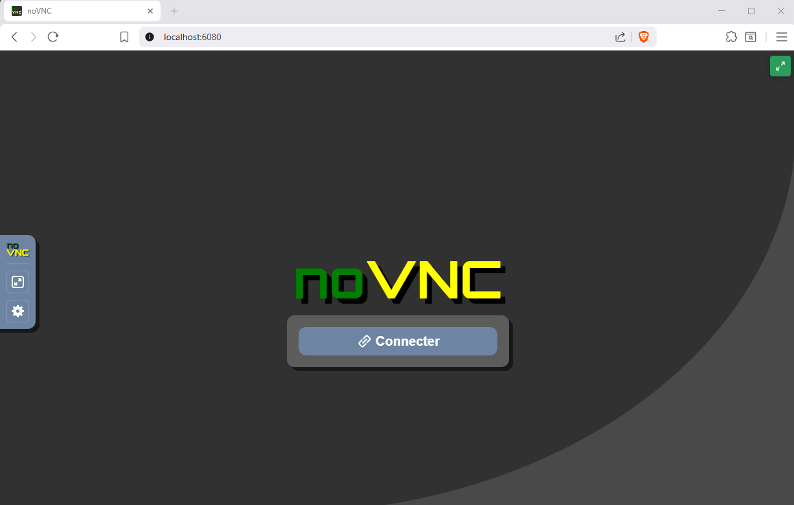
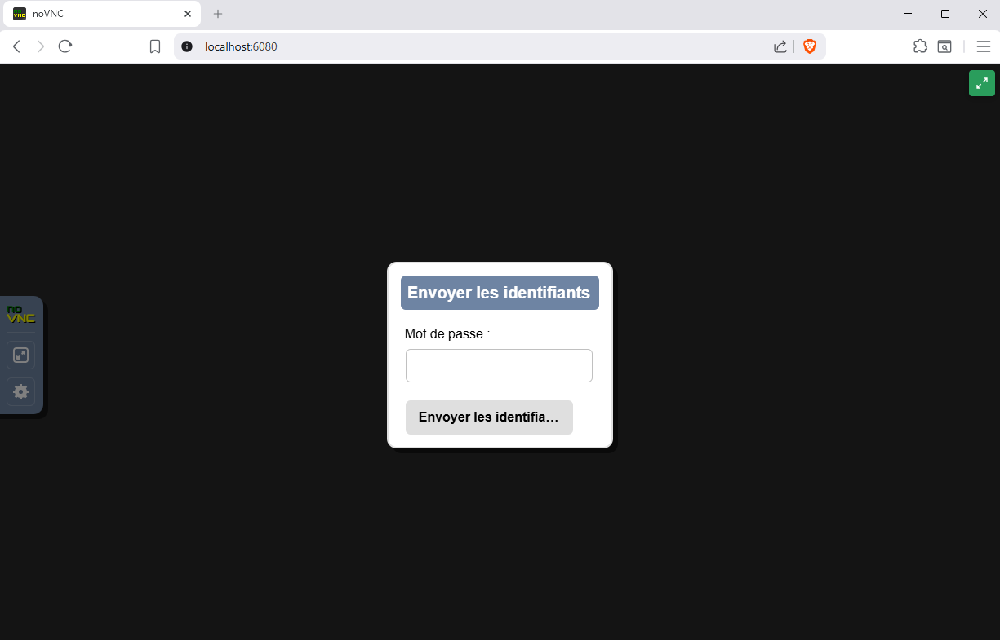
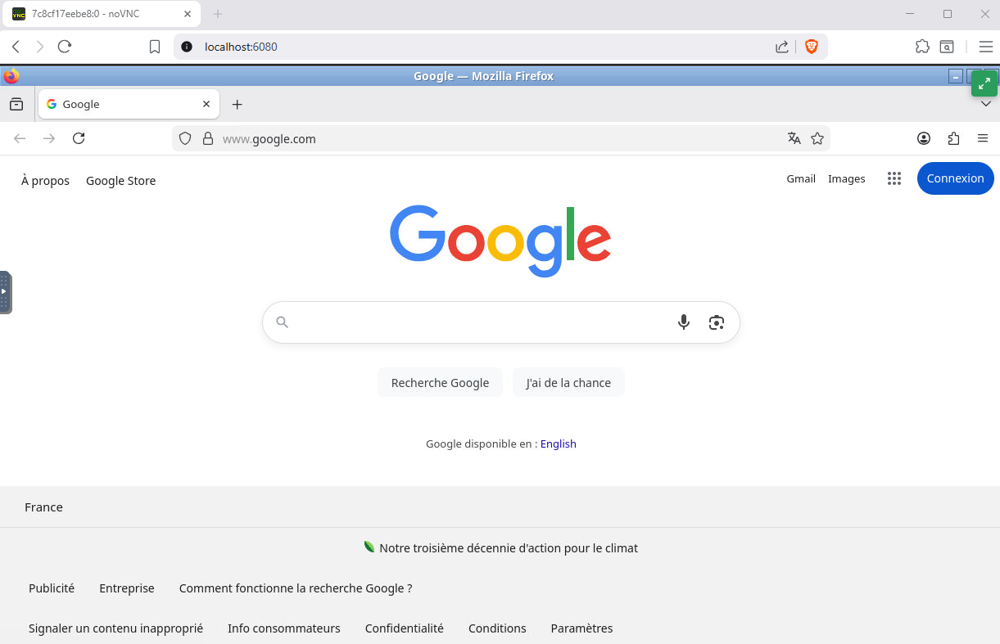
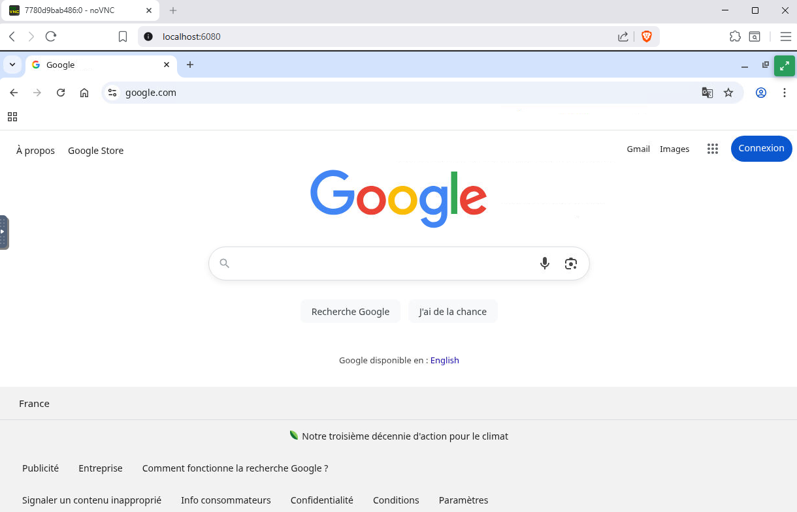
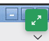

# Docker Browser VNC

A lightweight Docker container providing Firefox or Chromium browsers accessible via VNC and noVNC (web-based).

## Features

- **Dual access**: Native VNC (port 5901) and web-based noVNC (port 6080)
- **Browser choice**: Firefox or Chromium (configurable)
- **Dynamic resolution**: Auto-resize button adapts resolution to browser window
- **Minimal footprint**: Alpine Linux with multi-stage build
- **Persistent profiles**: Support for custom browser configurations, bookmarks, and policies
- **Non-root execution**: Runs as unprivileged user for security

## Quick start

### Using Docker run

```bash
# Firefox (default)
docker run -d -p 5901:5901 -p 6080:6080 -p 6081:6081 docker-browser-vnc

# Chromium
docker run -d -p 5901:5901 -p 6080:6080 -p 6081:6081 -e BROWSER=chromium docker-browser-vnc

# Custom starting URL
docker run -d -p 5901:5901 -p 6080:6080 -p 6081:6081 \
  -e STARTING_URL="https://example.com" \
  docker-browser-vnc
```

### Using Docker compose

```yaml
services:
  # Firefox (default)
  firefox:
    image: ghcr.io/maximewewer/docker-browser-vnc:latest
    ports:
      - "5901:5901"  # VNC
      - "6080:6080"  # noVNC (web)
      - "6081:6081"  # Resize API
    environment:
      - VNC_PW=mysecretpassword
      - STARTING_URL=https://example.com
    volumes:
      - ./my-config:/user-data:ro  # Optional: custom browser config

  # Chromium
  chromium:
    image: ghcr.io/maximewewer/docker-browser-vnc:chromium
    ports:
      - "5902:5901"
      - "6082:6080"
      - "6083:6081"
    environment:
      - VNC_PW=mysecretpassword
```

## Accessing the browser

- **Web Browser**: Navigate to `http://localhost:6080` - no VNC client required
- **VNC Client**: Connect to `localhost:5901` with your preferred VNC viewer

|                    noVNC Interface                    |                  noVNC Login                  |
| :---------------------------------------------------: | :-------------------------------------------: |
|  |  |

|                    Firefox example                    |                  Chromium example                  |
| :---------------------------------------------------: | :------------------------------------------------: |
|  |  |

## Environment variables

| Variable         | Default     | Description                                  |
| ---------------- | ----------- | -------------------------------------------- |
| `VNC_PW`         | `changeme`  | VNC connection password                      |
| `VNC_RESOLUTION` | `1920x1080` | Display resolution                           |
| `VNC_COL_DEPTH`  | `24`        | Color depth (bits)                           |
| `VNC_PORT`       | `5901`      | Native VNC port                              |
| `NOVNC_PORT`     | `6080`      | noVNC web port                               |
| `STARTING_URL`   | _(empty)_   | Initial URL (uses profile settings if empty) |

## Exposed ports

| Port | Protocol | Description         |
| ---- | -------- | ------------------- |
| 5901 | TCP      | Native VNC server   |
| 6080 | TCP      | noVNC web interface |
| 6081 | TCP      | Resize API          |

## Browser customization

Mount a volume to `/user-data` to customize browser profiles and settings. If no `STARTING_URL` is provided and custom configuration exists, the browser will use the startup page defined in the profile settings.

### Directory structure

```
/user-data/
├── firefox-policies/
│   └── policies.json       # Firefox enterprise policies
├── firefox-profile/
│   └── user.js             # Firefox preferences
└── chromium-profile/
    ├── Preferences         # Chromium preferences (JSON)
    └── Bookmarks           # Chromium bookmarks (JSON)
```

### Example usage

```bash
# Use provided examples
docker run -d -p 6080:6080 \
  -v $(pwd)/examples:/user-data:ro \
  docker-browser-vnc

# Firefox with policies only
docker run -d -p 6080:6080 \
  -v /path/to/firefox-policies:/user-data/firefox-policies:ro \
  docker-browser-vnc

# Chromium with custom profile
docker run -d -p 6080:6080 -e BROWSER=chromium \
  -v /path/to/chromium-profile:/user-data/chromium-profile:ro \
  docker-browser-vnc
```

---

## Firefox configuration

Firefox supports two configuration methods: **policies** (enterprise/managed) and **user.js** (user preferences).

> **Documentation**: [Firefox Enterprise Policies](https://mozilla.github.io/policy-templates/)

### Firefox policies example

Create `/user-data/firefox-policies/policies.json`:

```json
{
  "policies": {
    "Homepage": {
      "URL": "https://example.com",
      "StartPage": "homepage"
    },
    "OverrideFirstRunPage": "",
    "OverridePostUpdatePage": "",
    "DisableTelemetry": true,
    "DisableFirefoxStudies": true,
    "DisablePocket": true,
    "DisplayBookmarksToolbar": "always",
    "NoDefaultBookmarks": true,
    "ManagedBookmarks": [
      {
        "toplevel_name": "Company Links"
      },
      {
        "name": "Example Site",
        "url": "https://example.com"
      },
      {
        "name": "GitHub",
        "url": "https://github.com"
      },
      {
        "name": "Search",
        "children": [
          { "name": "Google", "url": "https://google.com" },
          { "name": "DuckDuckGo", "url": "https://duckduckgo.com" }
        ]
      }
    ]
  }
}
```

**Key policies:**

- `Homepage.StartPage: "homepage"` - Open homepage on startup
- `OverrideFirstRunPage: ""` - Disable first run page
- `ManagedBookmarks` - Pre-configured bookmarks (read-only for users)

### Firefox user.js example

Create `/user-data/firefox-profile/user.js`:

```javascript
// --- Homepage & Startup ---
user_pref("browser.startup.homepage", "https://example.com");
user_pref("browser.startup.page", 1); // 0=blank, 1=homepage, 3=restore session

// --- Disable First Run & Welcome ---
user_pref("browser.aboutwelcome.enabled", false);
user_pref("browser.startup.homepage_override.mstone", "ignore");

// --- New Tab Page ---
user_pref("browser.newtabpage.enabled", false);
user_pref("browser.newtabpage.activity-stream.showSponsored", false);
user_pref("browser.newtabpage.activity-stream.showSponsoredTopSites", false);

// --- UI Customization ---
user_pref("browser.toolbars.bookmarksToolbar", "always");
user_pref("browser.uidensity", 1); // 0=normal, 1=compact, 2=touch

// --- Privacy ---
user_pref("privacy.donottrackheader.enabled", true);
user_pref("privacy.trackingprotection.enabled", true);

// --- Disable Annoyances ---
user_pref("browser.shell.checkDefaultBrowser", false);
user_pref("datareporting.policy.dataSubmissionEnabled", false);
user_pref("toolkit.telemetry.reportingpolicy.firstRun", false);
```

**Important:** `browser.startup.homepage_override.mstone: "ignore"` is required to prevent Firefox from showing its first-run page.

---

## Chromium configuration

Chromium uses JSON configuration files for preferences and bookmarks.

> **Documentation**: [Chromium Preferences](https://www.chromium.org/administrators/configuring-other-preferences/) | [Chromium Enterprise Policies](https://chromeenterprise.google/policies/)

### Chromium Preferences example

Create `/user-data/chromium-profile/Preferences`:

```json
{
  "browser": {
    "check_default_browser": false,
    "show_home_button": true
  },
  "bookmark_bar": {
    "show_on_all_tabs": true
  },
  "homepage": "https://example.com",
  "homepage_is_newtabpage": false,
  "session": {
    "restore_on_startup": 4,
    "startup_urls": ["https://example.com"]
  },
  "profile": {
    "default_content_setting_values": {
      "notifications": 2
    }
  }
}
```

**Key settings:**

- `restore_on_startup`: `4` = Open specific URLs, `1` = Restore last session, `5` = Open new tab
- `startup_urls` - URLs to open on startup (requires `restore_on_startup: 4`)
- `homepage` - URL for the home button (not the startup page)
- `notifications: 2` - Block notification prompts

### Chromium Bookmarks example

Create `/user-data/chromium-profile/Bookmarks`:

```json
{
  "checksum": "",
  "roots": {
    "bookmark_bar": {
      "children": [
        {
          "name": "Example Site",
          "type": "url",
          "url": "https://example.com/"
        },
        {
          "name": "GitHub",
          "type": "url",
          "url": "https://github.com/"
        },
        {
          "name": "Search",
          "type": "folder",
          "children": [
            { "name": "Google", "type": "url", "url": "https://google.com/" },
            { "name": "DuckDuckGo", "type": "url", "url": "https://duckduckgo.com/" }
          ]
        }
      ],
      "name": "Bookmarks bar",
      "type": "folder"
    },
    "other": { "children": [], "name": "Other bookmarks", "type": "folder" },
    "synced": { "children": [], "name": "Mobile bookmarks", "type": "folder" }
  },
  "version": 1
}
```

**Note:** The `checksum` field can be left empty; Chromium will recalculate it.

## Dynamic resolution

The container supports dynamic resolution changes (up to 4K) via the RANDR extension.

### Auto-resize button

A resize button is available in the top-right corner of the noVNC interface:

1. Open `http://localhost:6080/vnc.html?autoconnect=true`
2. Click the **resize button** (top-right corner)
3. When enabled (green), the resolution automatically adapts to your browser window size
4. The setting is saved in localStorage



### Resize API (port 6081)

You can also change resolution programmatically:

```bash
# Get current resolution
curl http://localhost:6081/resolution

# Set resolution
curl "http://localhost:6081/resize?width=1920&height=1080"
```

## Building

### Build with Firefox (default)

```bash
docker build -t docker-browser-vnc .
```

### Build with Chromium

```bash
docker build -t docker-browser-vnc --build-arg BROWSER=chromium .
```

## Image size breakdown

### Firefox image (~953 MB)

| Component            | Size    | Description                     |
| -------------------- | ------- | ------------------------------- |
| Firefox              | 240 MB  | Browser binaries and resources  |
| LLVM/Mesa            | 170 MB  | Graphics rendering (OpenGL)     |
| Fonts                | 134 MB  | Noto (111 MB), DejaVu, FreeFont |
| Python + NumPy       | 87 MB   | Required for websockify         |
| GTK, X11, other libs | ~280 MB | UI toolkit and X11 dependencies |
| TigerVNC + noVNC     | ~40 MB  | VNC server (Xvnc) + web client  |

### Chromium image (~1.05 GB)

| Component            | Size    | Description                               |
| -------------------- | ------- | ----------------------------------------- |
| Chromium             | 267 MB  | Browser binaries and resources            |
| LLVM/Mesa            | 170 MB  | Graphics rendering (OpenGL)               |
| Fonts                | 137 MB  | Noto (111 MB), DejaVu, FreeFont, OpenSans |
| Python + NumPy       | 87 MB   | Required for websockify                   |
| GTK, X11, other libs | ~350 MB | UI toolkit and X11 dependencies           |
| TigerVNC + noVNC     | ~40 MB  | VNC server (Xvnc) + web client            |

> **Note**: The base Alpine image is ~7 MB. Most of the image size comes from the browser and its graphical dependencies (Mesa/LLVM for GPU rendering, GTK for UI).

## Architecture

```
Container startup sequence:
┌─────────────────────────────────────────────────────────┐
│ supervisord (PID 1)                                     │
│ ├── Xvnc (TigerVNC X + VNC)     → Display :0, Port 5901 │
│ ├── Openbox (Window Manager)    → Launches browser      │
│ ├── noVNC (Web Proxy)           → Port 6080             │
│ └── resize-server (HTTP API)    → Port 6081             │
└─────────────────────────────────────────────────────────┘
```

### Components

| Component         | Purpose                                              |
| ----------------- | ---------------------------------------------------- |
| **Xvnc**          | TigerVNC: combined X server + VNC server             |
| **Openbox**       | Minimal window manager                               |
| **noVNC**         | HTML5 VNC client (web access)                        |
| **websockify**    | WebSocket to VNC protocol proxy                      |
| **resize-server** | HTTP API for dynamic resolution changes              |
| **supervisord**   | Process manager                                      |

### VNC Resize Support

TigerVNC provides native **SetDesktopSize** support, allowing VNC clients (Guacamole, TigerVNC Viewer, RealVNC) to request resolution changes directly via the VNC protocol. This enables automatic resize when the client window is resized.

## Health check

The container includes a health check that verifies the `Xvnc` process is running:

- Interval: 30 seconds
- Timeout: 10 seconds
- Start period: 15 seconds
- Retries: 3

## Desktop features

### Right-click menu

Right-click on the desktop background to access the Openbox menu:

- **Relaunch Browser**: Kills the current browser and relaunches it (useful if the browser becomes unresponsive or is accidentally closed)
- **Reconfigure Openbox**: Reloads the window manager configuration

### Window management

- The browser window is maximized by default
- Firefox: Window control buttons (minimize/close) are hidden by Openbox
- Chromium: See known limitations below

## Known limitations

### Chromium window controls

Chromium uses **client-side decorations** (CSD), meaning the browser draws its own title bar and window controls internally. This cannot be disabled by the window manager. As a result:

- The **minimize** and **close** buttons remain visible in the Chromium title bar
- If the user accidentally closes or minimizes Chromium, they can use the **right-click menu → Relaunch Browser** to restore it

This is a GTK/Chromium design choice and cannot be changed without losing the tab bar entirely.

### Firefox

Firefox respects window manager settings, so minimize and close buttons are properly hidden.

## Security considerations

- Container runs as non-root user (`user`, UID 1000)
- VNC password authentication enabled by default
- Mount user data as read-only (`:ro`) when possible
- Change the default VNC password in production

## Troubleshooting

### Cannot connect to VNC

1. Verify the container is running: `docker ps`
2. Check container logs: `docker logs <container_id>`
3. Ensure ports 5901/6080 are not in use

### Browser crashes or freezes

1. Increase shared memory: `docker run --shm-size=256m ...`
2. Check available memory in container
3. For Chromium, the container already uses `--no-sandbox` and `--disable-dev-shm-usage`

### Custom data not loading

1. Verify mount path: `docker exec <container_id> ls -la /user-data`
2. Check file permissions (readable by UID 1000)
3. Review container logs for loading messages
